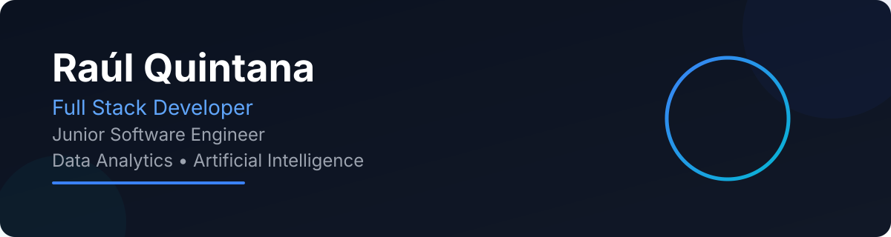

  

### 👨‍💻 Sobre mí

Soy estudiante de **10mo ciclo de Ingeniería Informática** en la **Universidad Ricardo Palma (URP)**.  
Me especializo en el desarrollo de software escalable, integrando **IA** y soluciones de **Ingeniería Sostenible**.  

Actualmente colaboro en proyectos de impacto real como Full Stack Developer y aspiro a especializarme en **Data Analysis**.

---

### 🛠️ Tech Stack & Skills

**Frontend & Mobile**  
     

**Backend, DB & Cloud**  
    

**Data Analysis & IA**  
   

**Tools**  
   

---

### 🚀 Featured Projects

<table>
  <tr>
    <td width="50%" valign="top">
      <h3> Nos Planet</h3>
      
Plataforma web de ingeniería sostenible desarrollada con React, Vite y WordPress REST API.

      <a href="https://nosplanet.org" target="_blank">🔗 Visitar proyecto</a>
    </td>
    <td width="50%" valign="top">
      <h3> Go Recycle</h3>
      
Aplicación web enfocada en la gestión y promoción del reciclaje.

      <a href="https://go-recycle.app" target="_blank">🔗 Visitar proyecto</a>
    </td>
  </tr>
  <tr>
    <td valign="top">
      <h3> Planet Bot</h3>
      
Bot inteligente para automatización de consultas y asistencia interna mediante IA.

      <a href="https://planet-bot.vercel.app" target="_blank">🔗 Visitar proyecto</a>
    </td>
    <td valign="top">
      <h3> Escuela Milan VMT</h3>
      
Sistema web para gestión deportiva desarrollado con React, Firebase y Tailwind CSS.

      <a href="https://escuela-milan-vmt.vercel.app" target="_blank">🔗 Visitar proyecto</a>
    </td>
  </tr>
  <tr>
    <td valign="top">
      <h3> Club Vya</h3>
      
Aplicación web para la administración del Club Vecinos y Amigos de VMT.

      <a href="https://club-vya.web.app" target="_blank">🔗 Visitar proyecto</a>
    </td>
    <td valign="top">
      <h3> Relatia</h3>
      
Portal y foro académico para estudiantes de Relaciones Internacionales orientado a la difusión de contenido y eventos.

      <a href="https://relatia.org" target="_blank">🔗 Visitar proyecto</a>
    </td>
  </tr>
  <tr>
    <td valign="top">
      <h3> Anthongc</h3>
      
Espacio digital dedicado a la reflexión, la literatura y la arquitectura construido como SPA moderna.

      <a href="https://anthongc.org" target="_blank">🔗 Visitar proyecto</a>
    </td>
    <td valign="top">
      <h3> Personal Portfolio</h3>
      
Portafolio personal desarrollado con React y Tailwind CSS, donde presento mis proyectos y experiencia.

      <a href="https://raulquin-dev.vercel.app" target="_blank">🔗 Visitar proyecto</a>
    </td>
  </tr>
</table>

---

### 📊 Estadísticas de Desarrollo

  

  
  

---

### 📫 Conectemos

* 🌐 **Portafolio:** [raulquin-dev.vercel.app](https://raulquin-dev.vercel.app)
* 💼 **LinkedIn:** [Raul Quintana](https://www.linkedin.com/in/raul-quintana-flores/)
* 📧 **Email:** [raulquintanazinc@gmail.com](mailto:raulquintanazinc@gmail.com)
